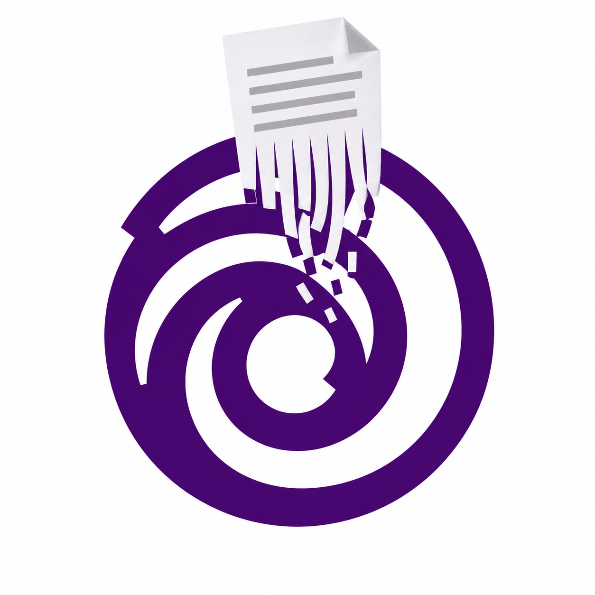

  

    

  
  
  
  

> [!CAUTION]
> **Use UbiSlot at your own discretion. Always create a backup of your Ubisoft achievement data before modifying anything. UbiSlot creates permanent backups of detected Ubisoft achievement spool files before making changes. Modifying achievement data may carry account or service-related risks.**

---

## Overview

UbiSlot is a Windows desktop application designed to manage and unlock Ubisoft Connect achievements using locally stored Ubisoft achievement data.
The application scans Ubisoft's local achievement data, identifies installed games, displays their achievements and icons, and provides an interface for selecting and unlocking achievements.

---

## Features

- Ubisoft Game Detection: Automatically scans locally stored Ubisoft achievement data.
- Game Identification: Matches Ubisoft Game IDs with their corresponding game names.
- Achievement Browser: Displays achievements for each detected Ubisoft game.
- Achievement Search: Search achievements by name or Achievement ID in real time.
- Game Search: Filter your Ubisoft game library by game name or Game ID.
- Achievement Selection: Select individual achievements before unlocking them.
- Automatic Backups: Creates permanent backups of Ubisoft achievement spool files before modifications.
- Dark Interface: A dark-themed WPF interface with a violet visual style.

---

## Installation
1. Download the latest UbiSlot.zip (64 bit) from the [Releases](https://github.com/BalTor02/UbiSlot/releases/tag/V.0.1.0) page.
2. Extract the ZIP file to a location of your choice.
3. Run UbiSlot.exe.
4. Make sure Ubisoft Connect is installed and that your Ubisoft achievement data is available locally.
5. UbiSlot will scan the local Ubisoft data automatically when it starts.

No separate installer is currently required.

---

## How it works

| Step  | Component                 | Description                                                                                                                                         |
| :---- | :------------------------ | :-------------------------------------------------------------------------------------------------------------------------------------------------- |
| **1** | **Ubisoft Game ID**       | UbiSlot reads the Ubisoft Game IDs stored in the local Ubislot games folder.                                                                        |
| **2** | **Game Database**         | Each Ubisoft Game ID is matched with its corresponding game name.                                                                                   |
| **3** | **Game Cover**            | The identified game name is used to find and download the game's cover artwork.                                                                     |
| **4** | **Achievement Archive**   | UbiSlot locates the achievement archive corresponding to the Ubisoft Game ID.                                                                       |
| **5** | **Achievement Data**      | Achievement names, descriptions, IDs, and unlock information are read from the local achievement data.                                              |
| **6** | **Achievement Icons**     | Achievement icons are extracted from the game's archive and stored in a game-specific cache.                                                        |
| **7** | **Achievement Selection** | The user can search through the game's achievements and select the achievements they want to unlock.                                                |
| **8** | **Backup**                | UbiSlot creates a permanent backup of the relevant Ubisoft achievement data before making changes.                                                  |
| **9** | **Unlock**                | The selected achievements are written to the appropriate Ubisoft local achievement data. Once achievement is unlocked, it CANNOT be locked again    |

---

## Backups

UbiSlot automatically creates permanent backups of detected Ubisoft achievement spool files before working with them.

This provides a recovery point in case you need to restore your original achievement data.

> [!CAUTION]
> Although UbiSlot creates backups automatically, maintaining your own additional backup is strongly recommended.

---

## Credits

BalTor - UbiSlot Developer

NikitaGareev - Uplay Game ID

PSerban93 - Ubisoft achievement data extraction technique

---

## Support the Project

If UbiSlot saved you some time, prevented tedious grinding, or helped you achieve 100% completion, consider supporting the repository. Your feedback and support keep these archives updated and visible to the community.

### Ways to Support

* **⭐ Star this Repository:** Click the **Star** button at the top right of this page. It costs nothing and helps other users discover UbiSlot.
* **👤 Follow the Profile:** Follow [@BalTor02](https://github.com/BalTor02) to stay updated on future projects and releases.
* **💖 Sponsor the Work:** If you want to financially support the development and maintenance of UbiSlot, consider sponsoring via the link below.

  

---

## Disclaimer

UbiSlot is an independent community project and is not affiliated with, endorsed by, or sponsored by Ubisoft Entertainment.

Ubisoft, Ubisoft Connect, and related trademarks belong to their respective owners.

UbiSlot is provided for educational, archival, and personal-use purposes. Users are responsible for how they use the software and for complying with the terms and policies applicable to their Ubisoft account and games.

---

## FAQ

### 1. What is UbiSlot?
>UbiSlot is a Windows desktop application for managing and unlocking Ubisoft Connect achievements using locally stored Ubisoft achievement data.

### 2. Does UbiSlot use Steam?
>No. UbiSlot works with Ubisoft's local achievement data. Steam is only used as a source for game cover artwork; it is not used for game identification or achievement data.

### 3. Does UbiSlot modify my game files?
>No. UbiSlot works with Ubisoft's locally stored achievement data rather than modifying the entire game installation files.

### 4. Where does UbiSlot get the games from?
>UbiSlot scans Ubisoft's local game data and uses the Ubisoft Game ID to identify the corresponding game.

### 5. Do I need Ubisoft Connect installed?
>Yes. UbiSlot is designed around Ubisoft Connect's locally stored data.

### 6. Do I need to own the game?
>Yes. You need to own a **legitimate, purchased copy of the Ubisoft game** and have it associated with your Ubisoft account. UbiSlot does not support cracked or pirated games.

### 7. Will UbiSlot delete my existing achievement data?
>UbiSlot is designed to create a permanent backup of detected achievement spool files before making changes. However, you should still maintain your own backup before using the application.

### 8. Can I unlock individual achievements?
>Yes. You can select individual achievements from a game's achievement list before unlocking them.

### 9. Can I unlock all achievements at once?
>Yes.

### 10. Why are some game covers missing?
>Game covers are matched using the identified game name. Some Ubisoft titles, regional versions, editions, or differently named releases may not have a matching cover available from the image source.

### 11. Why do some achievements have no icon?
>UbiSlot extracts achievement icons from the corresponding Ubisoft achievement archive. If an icon is not present in the archive, UbiSlot cannot display it.

### 12. Is UbiSlot affiliated with Ubisoft?
>No. UbiSlot is an independent community project and is not affiliated with, endorsed by, or sponsored by Ubisoft.

### 13. Is UbiSlot open source?
>Yes. The source code is publicly available in this repository under the MIT License. UbiSlot itself is free to use. If someone charged you money specifically for UbiSlot, you were likely scammed.

### 14. Something isn't working. What should I do?
>First, make sure Ubisoft Connect is installed and that the relevant Ubisoft game has generated local achievement data.

If the problem persists, open a GitHub Issue and provide:

Ubisoft game affected
What actually happened

Do not upload personal Ubisoft account information or private files to an issue.

---

## License

This project is licensed under the MIT License.

You are free to use, copy, modify, merge, publish, distribute, sublicense, and sell copies of the software, subject to the conditions of the MIT License.
