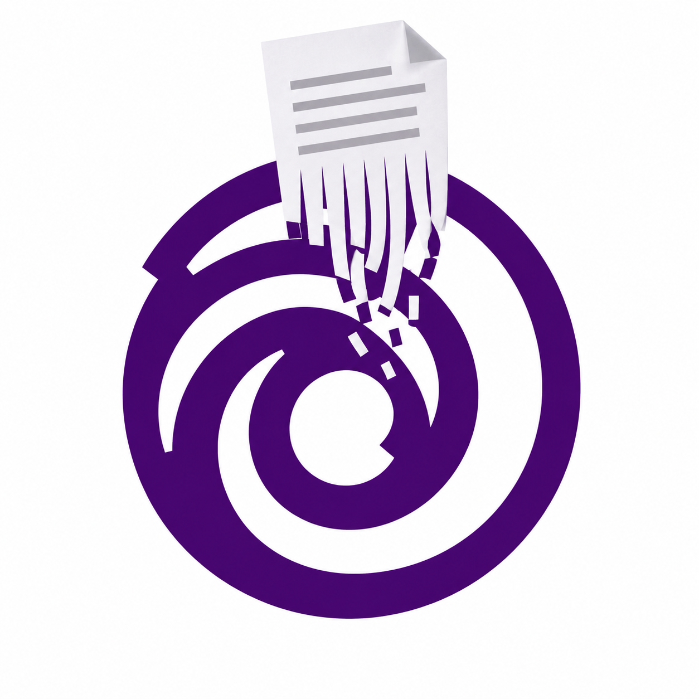

  

    

  
  
  
  

> [!CAUTION]
> **Use UbiSlot at your own discretion. Always create a backup of your Ubisoft achievement data before modifying anything. UbiSlot creates permanent backups of detected Ubisoft achievement spool files before making changes. Modifying achievement data may carry account or service-related risks.**

---

## Overview

UbiSlot is a Windows desktop application for managing and unlocking Ubisoft Connect achievements using locally stored Ubisoft achievement data.

UbiSlot scans Ubisoft's local ownership and achievement data, identifies supported Ubisoft games, displays their achievements and icons, and provides an interface for selecting and unlocking achievements.

UbiSlot is currently in **beta testing**.

---

## Current Version

**UbiSlot `v0.3.0-beta`**

This release is feature-complete for the current development cycle, but thorough testing is still required across different Ubisoft games and installations. Unknown bugs and game-specific compatibility issues may remain.

---

## Features

- **Ubisoft Game Library:** Detects Ubisoft-owned games from locally stored Ubisoft ownership data.
- **Game Identification:** Matches Ubisoft Game IDs with their corresponding game names using the bundled game database.
- **Achievement Browser:** Displays achievement names, descriptions, IDs, icons, and unlock status.
- **Achievement Search:** Search achievements by name or Achievement ID in real time.
- **Achievement Sorting:** Sort achievements by Name, ID, Date Achieved, Locked, or Unlocked.
- **Date Sorting:** Sort achieved achievements from oldest to newest.
- **Achievement Selection:** Select individual locked achievements before unlocking them.
- **Select All Locked:** Select or deselect all currently locked achievements at once.
- **Game Search:** Filter the Ubisoft game library by game name or Game ID.
- **Game Covers:** Automatically retrieves compatible cover artwork and stores it locally for future use.
- **Automatic Backups:** Creates permanent backups of relevant Ubisoft achievement spool data before making changes.
- **Session Restore:** Restore the achievement data captured when UbiSlot opened the current game session.
- **Configurable Backup Location:** Choose where UbiSlot stores its backups.
- **Dark and Light Themes:** Switch between dark and light interface themes.
- **Library Settings:** Control game-name, completion, and zero-achievement game visibility.
- **Automatic Update Checking:** Check for newer UbiSlot releases.
- **Custom Dialogues:** Uses custom confirmation, information, and error dialogue windows.
- **Ubisoft Session Handling:** Handles Ubisoft-managed game sessions and already-running Ubisoft games.

---

## Installation

Download the latest beta release from the [Releases](https://github.com/BalTor02/UbiSlot/releases) page.

1. Download the latest **UbiSlot ZIP**.
2. Extract the ZIP file to a location of your choice.
3. Make sure **Ubisoft Connect** is installed and logged in.
4. Run **UbiSlot.exe**.
5. Wait for UbiSlot to scan the locally available Ubisoft data and populate the game library.

No separate installer is currently required.

---

## How to use

1. Make sure **Ubisoft Connect is logged in and running**.
2. Make sure **no Ubisoft game is currently running in the background**.
3. Launch **UbiSlot** and allow the library to load. On some systems, this may take up to a couple of minutes.
4. UbiSlot scans Ubisoft's local ownership data and displays supported Ubisoft games.
5. Select a game to open its **Achievement Manager**.
6. UbiSlot starts or attaches to the appropriate Ubisoft game session as required.
7. In the Achievement Manager:
   - Use **Search** to find achievements by name or Achievement ID.
   - Use **Sort** to organize achievements by Name, ID, Date Achieved, Locked, or Unlocked.
   - **Date Achieved** sorts from oldest to newest.
   - Use **Select All Locked** to select all currently locked achievements.
   - Select individual achievements using their checkboxes.
8. Click **Get Achievement** and confirm the unlock.
9. UbiSlot writes the selected achievement changes immediately.
10. Keep the Achievement Manager open if you may want to use **Restore Original** during the same session.

### Restore Original

**Restore Original** restores the achievement data captured when UbiSlot opened the game.

It removes UbiSlot's achievement changes made during the current session. It does **not** lock achievements that have already been synchronized.

---

## How it works

| Step | Component | Description |
| :--- | :--- | :--- |
| **1** | **Ubisoft Ownership Data** | UbiSlot reads Ubisoft's locally stored ownership data to identify Ubisoft Game IDs available to the current user. |
| **2** | **Game Database** | Ubisoft Game IDs are matched against the bundled `UplayGames.txt` database to obtain game names. |
| **3** | **Game Cover** | The identified game name can be used to find compatible cover artwork, which is cached locally. |
| **4** | **Achievement Archive** | UbiSlot locates the achievement archive corresponding to the Ubisoft Game ID. |
| **5** | **Achievement Data** | Achievement IDs, names, descriptions, and local unlock information are read from the achievement data. |
| **6** | **Achievement Icons** | Achievement icons are extracted from the corresponding achievement archive and cached locally. |
| **7** | **Achievement Selection** | The user can search, sort, and select the achievements they want to unlock. |
| **8** | **Backup** | UbiSlot creates permanent backups of the relevant achievement spool data before making changes. |
| **9** | **Unlock** | The selected achievements are written to the appropriate local Ubisoft achievement data. |

---

## Backups

UbiSlot creates permanent backups of detected Ubisoft achievement spool files before making changes.

A backup is also captured when an achievement session is opened so that the **Restore Original** function can restore the local achievement data from the beginning of that session.

> [!CAUTION]
> Although UbiSlot creates backups automatically, maintaining your own additional backup is strongly recommended.

---

## Important

UbiSlot modifies locally stored Ubisoft achievement spool data.

Achievement unlocking and spool-data modification may carry risks. Avoid unlocking all achievements at once, especially during beta testing.

Once achievements have been synchronized, **Restore Original cannot be used to lock those synchronized achievements again through UbiSlot**.

---

## Notes

Steam achievement integration is **not included**.

Steam is used only as a source for compatible game cover artwork. UbiSlot does not use Steam for achievement data or Ubisoft game ownership.

UbiSlot does not bypass Ubisoft ownership, DRM, authentication, or server-side security.

Game compatibility depends on the availability and structure of Ubisoft's local achievement data.

---

## Credits

**BalTor** — UbiSlot Developer

**NikitaGareev** — Uplay Game ID

**PSerban93** — Ubisoft achievement data extraction technique

---

## Support the Project

If UbiSlot saved you some time, prevented tedious grinding, or helped you achieve 100% completion, consider supporting the repository. Your feedback and support help keep the project maintained and visible to the community.

### Ways to Support

- **⭐ Star this Repository:** Click the **Star** button at the top right of this page.
- **👤 Follow the Profile:** Follow [@BalTor02](https://github.com/BalTor02) for future projects and releases.
- **💖 Sponsor the Work:** Support the development and maintenance of UbiSlot through GitHub Sponsors.

  

---

## Disclaimer

UbiSlot is an independent community project and is not affiliated with, endorsed by, or sponsored by Ubisoft Entertainment.

Ubisoft, Ubisoft Connect, and related trademarks belong to their respective owners.

UbiSlot is provided for educational, archival, and personal-use purposes. Users are responsible for how they use the software and for complying with the terms and policies applicable to their Ubisoft account and games.

---

## FAQ

### 1. What is UbiSlot?

> UbiSlot is a Windows desktop application for managing and unlocking Ubisoft Connect achievements using locally stored Ubisoft achievement data.

### 2. Does UbiSlot use Steam?

> Not for achievements or ownership. Steam is only used as a source for compatible game cover artwork.

### 3. Does UbiSlot modify my game files?

> UbiSlot works with Ubisoft's locally stored achievement data rather than modifying the game's main installation files.

### 4. Where does UbiSlot get the games from?

> UbiSlot reads locally stored Ubisoft ownership data, identifies Ubisoft Game IDs, and matches those IDs against its bundled game database.

### 5. Do I need Ubisoft Connect installed?

> Yes. UbiSlot is designed around Ubisoft Connect's locally stored ownership, achievement, and session data.

### 6. Do I need to own the game?

> Yes. You need to own a legitimate copy of the Ubisoft game and have it associated with your Ubisoft account. UbiSlot does not support cracked or pirated games.

### 7. Will UbiSlot delete my existing achievement data?

> UbiSlot creates permanent backups of detected achievement spool files before making changes. However, maintaining your own backup is still strongly recommended.

### 8. Can I unlock individual achievements?

> Yes. You can select individual locked achievements before unlocking them.

### 9. Can I unlock all achievements at once?

> Yes, but this is **not recommended during beta testing**. Avoid unlocking all achievements at once.

### 10. Why are some game covers missing?

> Game covers are matched using the identified game name. Some Ubisoft titles, regional versions, editions, or differently named releases may not have a compatible cover available from the image source.

### 11. Why do some achievements have no icon?

> UbiSlot extracts achievement icons from the corresponding Ubisoft achievement archive. If an icon is not present in the archive, UbiSlot cannot display it.

### 12. Can UbiSlot lock an achievement again?

> UbiSlot's **Restore Original** function can restore the local achievement data captured at the beginning of the current session. It cannot lock achievements that have already been synchronized.

### 13. Is UbiSlot affiliated with Ubisoft?

> No. UbiSlot is an independent community project and is not affiliated with, endorsed by, or sponsored by Ubisoft.

### 14. Is UbiSlot open source?

> Yes. The source code is publicly available in this repository under the MIT License. UbiSlot itself is free to use. If someone charged you money specifically for UbiSlot, you were likely scammed.

### 15. Something isn't working. What should I do?

> First, make sure Ubisoft Connect is installed and logged in, and that the relevant Ubisoft game has locally available achievement data.
>
> If the problem persists, open a [GitHub Issue](https://github.com/BalTor02/UbiSlot/issues) and provide:
>
> - Ubisoft game affected
> - What you expected to happen
> - What actually happened
>
> Do not upload personal Ubisoft account information or private files to an issue.

---

## License

This project is licensed under the **MIT License**.

You are free to use, copy, modify, merge, publish, distribute, sublicense, and sell copies of the software, subject to the conditions of the MIT License.
